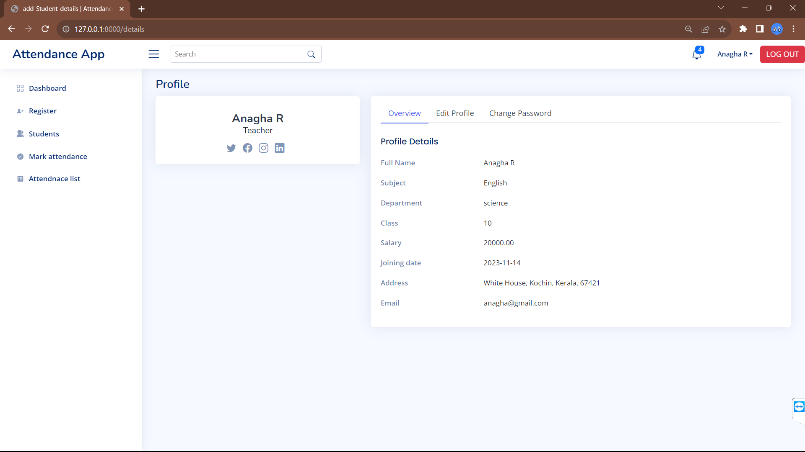

 <h1 align="center">Attendance Management App</h1>

<h3>Project Description</h3>

Developed a school-focused Attendance Management app using Laravel, featuring essential CRUD operations and intricate database relationships. The application enables effortless tracking of student attendance, with administrators and educators benefiting from streamlined data management and insightful analytics. This project showcases the efficiency of Laravel in crafting a scalable solution for attendance tracking, emphasizing the importance of CRUD operations and relationships in optimizing data handling within a school setting.

